# Network Security Threat Detection

> **End-to-end MLOps pipeline for phishing URL detection — from MongoDB to production on AWS EC2 via Docker and GitHub Actions CI/CD.**

[](https://github.com/SankalpMakol016/network-security)
[](http://13.204.46.129:8080/docs)
[](https://hub.docker.com)
[](https://python.org)
[](https://fastapi.tiangolo.com)
[](https://scikit-learn.org)
[](https://mlflow.org)
[](https://mongodb.com)
[](https://aws.amazon.com/s3)
[](https://aws.amazon.com/ecr)

**Live API:** `http://13.204.46.129:8080/docs` | **GitHub:** [SankalpMakol016/network-security](https://github.com/SankalpMakol016/network-security)

---

## Project Overview

Network threats — phishing URLs, malicious redirects, and fraudulent web pages — remain one of the most pervasive and costly attack vectors in cybersecurity. Static blocklists and rule-based filters fail to keep pace with the volume and sophistication of modern phishing campaigns.

This project delivers a **production-grade machine learning system** that learns structural and behavioral URL features to classify network traffic as legitimate or phishing in real time. The system is architected with separation of concerns across ingestion, validation, transformation, training, evaluation, and serving — and is fully automated from code commit to live deployment.

**Why this problem deserves ML:**

Traditional heuristics miss novel phishing patterns immediately after they appear. A Random Forest trained on 30 URL structural features — SSL state, domain age, anchor ratios, redirect depth, and more — achieves **95.1% accuracy and 99.2% ROC-AUC**, detecting threats that rule-based systems consistently overlook.

**Business impact:**

Organizations integrating this API into their network security stack can automatically screen URLs at ingestion time, flag anomalous traffic for analyst review, and reduce mean time to detect (MTTD) phishing attacks from hours to milliseconds.

---

## Key Features

| Feature | Description | Status |
|---|---|---|
| **Data Ingestion** | Pulls labeled network logs from MongoDB Atlas, splits into train/test sets | ✅ Implemented |
| **Schema Validation** | Column presence, dtype checks, zero-tolerance missing value policy | ✅ Implemented |
| **Data Drift Detection** | Kolmogorov-Smirnov statistical test across all 30 features | ✅ Implemented |
| **Data Transformation** | StandardScaler normalization + SMOTE oversampling for class imbalance | ✅ Implemented |
| **Model Training** | Configurable Random Forest (200 estimators, depth 10) or XGBoost | ✅ Implemented |
| **Model Evaluation** | Accuracy, precision, recall, F1, ROC-AUC; baseline comparison; threshold gating | ✅ Implemented |
| **MLflow Experiment Tracking** | Parameter logging, metric tracking, model artifact registry | ✅ Implemented |
| **S3 Artifact Sync** | Trained models and pipeline artifacts pushed to `network-security-bucket1` | ✅ Implemented |
| **Prediction Service** | FastAPI `/predict` endpoint accepting CSV uploads | ✅ Implemented |
| **Health Check API** | `/health` endpoint reports pipeline readiness | ✅ Implemented |
| **Dockerized Deployment** | Multi-stage `python:3.11-slim` image with AWS CLI, exposed on port 8080 | ✅ Implemented |
| **ECR Container Registry** | Private ECR repository (`networksecurity`) stores versioned images | ✅ Implemented |
| **EC2 Deployment** | t3.small instance (ap-south-1b) running containerized API | ✅ Implemented |
| **CI/CD Automation** | Three-stage GitHub Actions: integration → build/push → deploy | ✅ Implemented |

---

## System Architecture

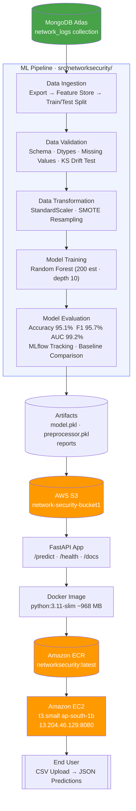

---

## Project Structure

```
network-security/
│
├── app.py                          # FastAPI application entry point
├── main.py                         # Training pipeline runner
├── push_data.py                    # MongoDB data loader utility
├── dockerfile                      # Container build definition
├── requirements.txt                # Pinned Python dependencies
├── setup.py                        # Package installation config
│
├── config/
│   ├── config.yaml                 # Paths, thresholds, database config
│   ├── schema.yaml                 # 30-feature column schema + target
│   └── model.yaml                  # Model name and hyperparameters
│
├── data/
│   ├── raw/                        # Raw exports from MongoDB
│   └── processed/                  # Train/test/transformed CSVs
│
├── artifacts/
│   ├── data_validation/            # JSON validation reports
│   ├── model_evaluation/           # JSON evaluation reports + metrics
│   ├── preprocessor/               # Serialized StandardScaler (.pkl)
│   └── saved_model/                # Trained model artifact (.pkl)
│
├── mlruns/                         # Local MLflow experiment tracking store
│
├── src/networksecurity/
│   ├── cloud/
│   │   └── s3_syncer.py            # AWS S3 bidirectional sync utility
│   │
│   ├── components/
│   │   ├── data_ingestion.py       # MongoDB → CSV ingestion
│   │   ├── data_validation.py      # Schema + drift validation
│   │   ├── data_transformation.py  # Scaling + SMOTE
│   │   ├── model_trainer.py        # Training orchestration
│   │   └── model_evaluation.py     # Metrics, MLflow, threshold gating
│   │
│   ├── configuration/
│   │   └── mongo_db_connection.py  # MongoDB Atlas client factory
│   │
│   ├── constants/
│   │   └── __init__.py             # Config file path constants
│   │
│   ├── entity/
│   │   ├── config_entity.py        # Typed pipeline configuration dataclasses
│   │   └── artifact_entity.py      # Typed pipeline artifact dataclasses
│   │
│   ├── exception/
│   │   └── exception.py            # Custom NetworkSecurityException
│   │
│   ├── logging/
│   │   └── logger.py               # Timestamped file + console logging
│   │
│   ├── pipeline/
│   │   ├── training_pipeline.py    # End-to-end training orchestrator
│   │   └── prediction_pipeline.py  # Inference pipeline (model + preprocessor)
│   │
│   └── utils/
│       ├── main_utils.py           # YAML reader, general helpers
│       └── ml_utils.py             # Joblib save/load for model artifacts
│
├── tests/
│   └── test_training_pipeline.py   # pytest integration tests
│
└── .github/
    └── workflows/
        └── main.yaml               # CI/CD pipeline (3-stage)
```

**Key directory purposes:**

`src/networksecurity/components/` — Each pipeline stage is a self-contained class with explicit inputs, outputs, and artifact contracts. Stages communicate through typed artifact dataclasses, not global state.

`artifacts/` — The only directory that persists cross-stage outputs. Automatically synced to AWS S3 after training, and downloaded by the prediction pipeline at API startup.

`config/` — All thresholds, hyperparameters, and file paths live here. Changing model behavior requires only a YAML edit — no code changes.

---

## ML Pipeline Deep Dive

### Stage 1 — Data Ingestion

**Input:** MongoDB Atlas connection (database: `network_security`, collection: `network_logs`)

**Output:** `DataIngestionArtifact` — paths to `data/raw/network_data.csv`, `data/processed/train.csv`, `data/processed/test.csv`

The `DataIngestion` component opens a PyMongo connection, exports the entire collection as a Pandas DataFrame, strips the `_id` column, persists the raw data as a CSV feature store, and performs a stratified `train_test_split` at an 80/20 ratio with `random_state=42` for reproducibility.

### Stage 2 — Data Validation

**Input:** Train and test CSVs from Stage 1

**Output:** `DataValidationArtifact` — JSON validation report, validity flag

Four independent checks run against the `config/schema.yaml` contract:

Column validation confirms all 30 expected feature columns and the `Result` target column are present. Dtype validation verifies every column carries integer-compatible values. Missing value validation enforces a zero-tolerance threshold — any null in any column fails validation. Drift detection applies the two-sample **Kolmogorov-Smirnov test** (`p < 0.05`) across all 30 features between train and test distributions. All 30 features passed drift detection in the evaluated run (minimum p-value: 0.27).

### Stage 3 — Data Transformation

**Input:** Validated train and test CSVs

**Output:** `DataTransformationArtifact` — transformed CSVs, serialized `preprocessor.pkl`

A `StandardScaler` is fit on training features only and applied to both sets, preventing data leakage. Target labels are remapped from {-1, +1} → {0, 1}. **SMOTE** (Synthetic Minority Oversampling Technique) is then applied to the scaled training data to address class imbalance, generating synthetic phishing samples until both classes are balanced. The fitted scaler is persisted with Joblib for use at inference time.

### Stage 4 — Model Training

**Input:** Transformed train CSV

**Output:** `ModelTrainerArtifact` — serialized `model.pkl`

The trainer reads `config/model.yaml` to select the algorithm and hyperparameters — currently a `RandomForestClassifier` with 200 trees, max depth of 10, `sqrt` feature sampling, and parallel execution (`n_jobs=-1`). The architecture supports switching to XGBoost by editing four lines of YAML with no code changes. The trained model is serialized with Joblib.

### Stage 5 — Model Evaluation

**Input:** Transformed test CSV, trained model

**Output:** `ModelEvaluationArtifact` — evaluation report JSON, acceptance flag

The evaluator computes accuracy, precision, recall, F1, and ROC-AUC for both the candidate model and a `DummyClassifier` baseline. Results are logged to **MLflow** (parameters, 10 metrics, sklearn model artifact). If accuracy falls below 0.85 or F1 below 0.85, the pipeline raises an exception and blocks artifact promotion. The final model cleared both thresholds by a significant margin.

**Achieved metrics on held-out test set:**

| Metric | Score |
|---|---|
| Accuracy | **95.07%** |
| Precision | **94.35%** |
| Recall | **97.13%** |
| F1 Score | **95.72%** |
| ROC-AUC | **99.17%** |
| Improvement over baseline (F1) | **+95.72 pp** |

### Stage 6 — Artifact Persistence

After evaluation, the `TrainingPipeline` calls `S3Syncer` twice: once to push the entire `artifacts/` directory to `s3://network-security-bucket1/artifacts`, and again to push `artifacts/saved_model/` to `s3://network-security-bucket1/saved_models`. The Docker image includes the AWS CLI so the running container can pull artifacts at startup.

---

## Tech Stack

| Category | Technology | Version | Purpose |
|---|---|---|---|
| Language | Python | 3.11 | Core runtime |
| API Framework | FastAPI | 0.112.2 | REST prediction endpoint |
| API Server | Uvicorn | 0.30.6 | ASGI server, port 8080 |
| Data Validation | Pydantic | v2 | Request/response schemas |
| ML Library | scikit-learn | 1.5.1 | RandomForest, StandardScaler, metrics |
| Imbalanced Learning | imbalanced-learn | 0.12.3 | SMOTE oversampling |
| Gradient Boosting | XGBoost | 2.1.1 | Alternate model (configurable) |
| Data Processing | Pandas | 2.2.2 | DataFrame operations |
| Numerical Computing | NumPy | 1.26.4 | Array transformations |
| Model Serialization | Joblib | 1.4.2 | Save/load .pkl artifacts |
| Statistical Testing | SciPy | — | Kolmogorov-Smirnov drift test |
| Experiment Tracking | MLflow | 2.15.1 | Metrics, params, model registry |
| Data Versioning | DVC | 3.55.2 | Data pipeline versioning |
| Database | MongoDB + PyMongo | 4.8.0 | Source of truth for labeled data |
| Config | PyYAML | 6.0.2 | YAML-driven configuration |
| Environment | python-dotenv | 1.0.1 | Secret management via .env |
| Cloud Storage | boto3 / AWS S3 | 1.35.10 | Artifact persistence |
| Container Runtime | Docker | — | Reproducible deployment unit |
| Container Registry | Amazon ECR | — | Private image storage |
| Compute | Amazon EC2 (t3.small) | — | API hosting (ap-south-1b) |
| CI/CD | GitHub Actions | — | Automated build-test-deploy |
| Testing | pytest | 8.3.2 | Integration test suite |
| Type Checking | mypy | 1.11.1 | Static type enforcement |
| Linting | flake8 | 7.1.1 | Code style enforcement |

---

## Deployment Architecture

### Containerization Strategy

The `dockerfile` uses `python:3.11-slim` as the base, installs the AWS CLI via `curl` during build, copies `requirements.txt` first (layer caching), installs all Python dependencies, copies the application source, sets `PYTHONPATH=/app/src` so the `networksecurity` package resolves correctly, and launches Uvicorn on port 8080.

The image ships as `linux/amd64` to ensure compatibility with EC2's x86_64 architecture, avoiding ARM compatibility issues when building on Apple Silicon.

### ECR → EC2 Deployment Flow

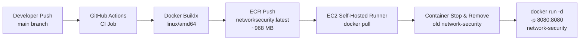

**Verified deployment state (from EC2 console and terminal):**

The `NetworkSecurity` EC2 instance (`i-048984847bbf572e0`) runs on a `t3.small` in `ap-south-1b` with public IP `13.204.46.129`. The Ubuntu 26.04 LTS host shows the ECR image `209866815360.dkr.ecr.ap-south-1.amazonaws.com/networksecurity:latest` (968 MB) pulled and available. The container exposes the FastAPI application at `:8080`.

---

## CI/CD Pipeline

The GitHub Actions workflow (`.github/workflows/main.yaml`) triggers on every push to `main` and executes three sequential jobs:

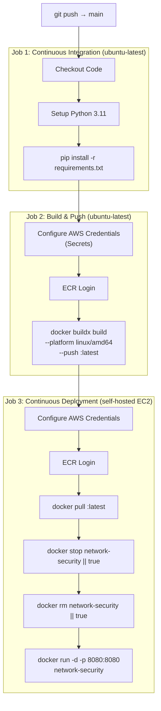

**Secrets required:**

`AWS_ACCESS_KEY_ID`, `AWS_SECRET_ACCESS_KEY`, `AWS_REGION`, `AWS_ECR_LOGIN_URI`, `ECR_REPOSITORY_NAME`

The EC2 instance acts as a **self-hosted runner** for the deployment job. This eliminates the need for SSH key management in the workflow — the runner process on the instance pulls the image and restarts the container directly.

---

## API Documentation

**Base URL:** `http://13.204.46.129:8080`

**Swagger UI:** `http://13.204.46.129:8080/docs`

**OpenAPI JSON:** `http://13.204.46.129:8080/openapi.json`

### Endpoints

| Method | Endpoint | Description |
|---|---|---|
| `GET` | `/` | Service info — name, version, available routes |
| `GET` | `/health` | Pipeline readiness check |
| `POST` | `/predict` | Upload CSV → receive binary predictions |

### `GET /health`

```json
{
  "status": "ok",
  "pipeline_loaded": true
}
```

Returns `"status": "degraded"` if the prediction pipeline failed to load at startup.

### `POST /predict`

**Request:** `multipart/form-data`, field name `file`, content type `text/csv`

The CSV must contain the 30 URL feature columns defined in `config/schema.yaml`. An optional `Result` target column is automatically dropped if present (enabling direct upload of test sets).

**Response:**

```json
{
  "status": "success",
  "rows_processed": 885,
  "predictions": [1, 0, 1, 1, 0, ...]
}
```

`1` = Phishing / Malicious, `0` = Legitimate

**Error responses:** `400` — non-CSV file or empty file; `503` — pipeline unavailable; `500` — internal prediction error.

<details>
<summary>Example curl request</summary>

```bash
curl -X POST "http://13.204.46.129:8080/predict" \
     -H "accept: application/json" \
     -F "file=@data/processed/test.csv"
```

</details>

---

## Installation Guide

### Prerequisites

Python 3.11+, Git, MongoDB Atlas connection string, AWS credentials (for S3/ECR), Docker (for containerized deployment).

### 1. Clone the repository

```bash
git clone https://github.com/SankalpMakol016/network-security.git
cd "network-security"
```

### 2. Create and activate a virtual environment

```bash
python -m venv venv
source venv/bin/activate        # macOS/Linux
# venv\Scripts\activate         # Windows
```

### 3. Install dependencies

```bash
pip install -r requirements.txt
pip install -e .
```

### 4. Configure environment variables

Create a `.env` file in the project root:

```env
MONGO_DB_URL=mongodb+srv://<username>:<password>@<cluster>.mongodb.net/
AWS_ACCESS_KEY_ID=<your-key-id>
AWS_SECRET_ACCESS_KEY=<your-secret>
AWS_REGION=ap-south-1
AWS_BUCKET_URL=s3://network-security-bucket1
```

### 5. (Optional) Push data to MongoDB

```bash
python push_data.py
```

This script loads `data/raw/phisingData.csv` into MongoDB. Skip this step if data is already in the Atlas collection.

### 6. Run the training pipeline

```bash
python main.py
```

Pipeline stages execute sequentially. Artifacts land in `artifacts/`. MLflow tracking logs to `mlruns/`.

### 7. Start the API locally

```bash
uvicorn app:app --host 0.0.0.0 --port 8080 --reload
```

Visit `http://localhost:8080/docs` to test via Swagger UI.

### 8. Run with Docker

```bash
docker build -t networksecurity:local .
docker run -d \
  --name network-security \
  -p 8080:8080 \
  --env-file .env \
  networksecurity:local
```

---

## AWS Deployment Guide

### Prerequisites

AWS CLI installed and configured, ECR repository created (`networksecurity`), EC2 instance provisioned with Docker and the GitHub Actions self-hosted runner agent.

### Step 1 — Create ECR repository

```bash
aws ecr create-repository \
    --repository-name networksecurity \
    --region ap-south-1
```

### Step 2 — Create S3 bucket

```bash
aws s3 mb s3://network-security-bucket1 --region ap-south-1
```

### Step 3 — Provision EC2

Launch a `t3.small` instance (Ubuntu 26.04 LTS) in `ap-south-1`. Open port 8080 in the security group. Install Docker:

```bash
sudo apt-get update
sudo apt-get install -y docker.io
sudo usermod -aG docker ubuntu
```

### Step 4 — Configure GitHub Actions self-hosted runner

In the GitHub repository, go to **Settings → Actions → Runners** and follow the self-hosted runner installation steps on the EC2 instance.

### Step 5 — Add repository secrets

In **Settings → Secrets → Actions**, add: `AWS_ACCESS_KEY_ID`, `AWS_SECRET_ACCESS_KEY`, `AWS_REGION`, `AWS_ECR_LOGIN_URI`, `ECR_REPOSITORY_NAME`.

### Step 6 — Deploy

Push to `main`. GitHub Actions handles the rest: runs integration checks, builds and pushes the Docker image to ECR, then the self-hosted runner on EC2 pulls and restarts the container.

---

## Screenshots

### Amazon ECR — Private Repository

The `networksecurity` private ECR repository holds 4 image layers with `latest` tagged at 968.10 MB (AES-256 encrypted), stored in the `ap-south-1` region.

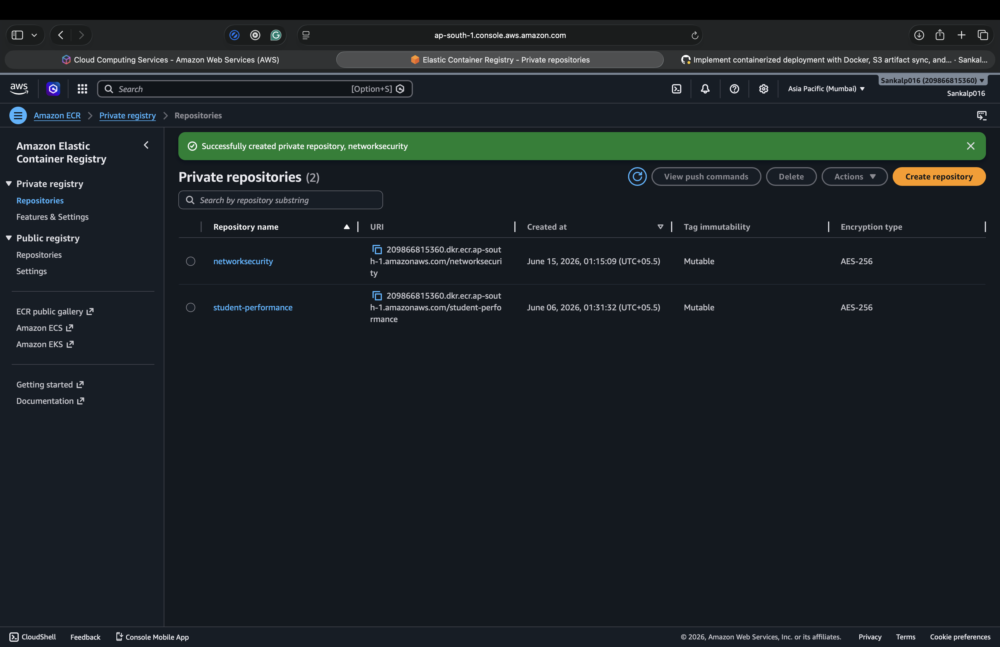

### Amazon ECR — Image History

`networksecurity:latest` built at `02:25:30 UTC+05:5` alongside prior image index and layer variants, confirming multi-platform buildx push behavior.

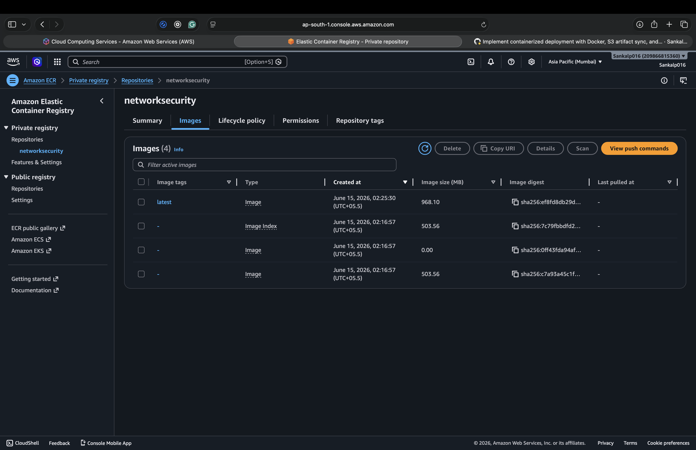

### Amazon S3 — Artifact Storage

`network-security-bucket1` created on June 15, 2026 in `ap-south-1` stores training artifacts synced via `S3Syncer` after each successful pipeline run.

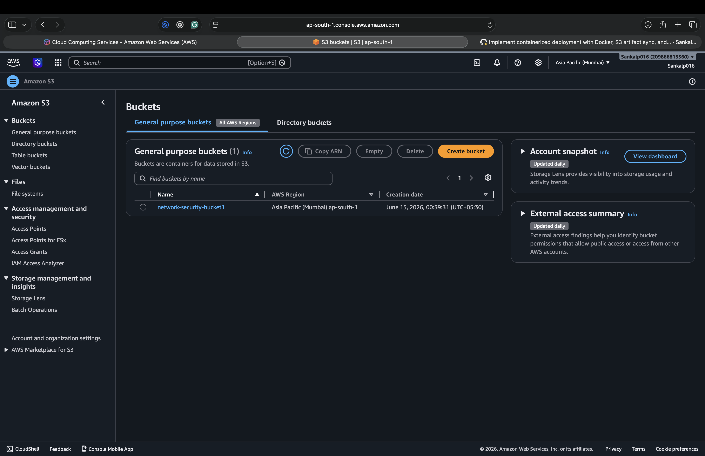

### Amazon EC2 — Running Instance

`NetworkSecurity` instance (`i-048984847bbf572e0`, `t3.small`, `ap-south-1b`) in **Running** state with public IP `13.204.46.129`. The stopped `student-perfor...` instance from a previous project is also visible.

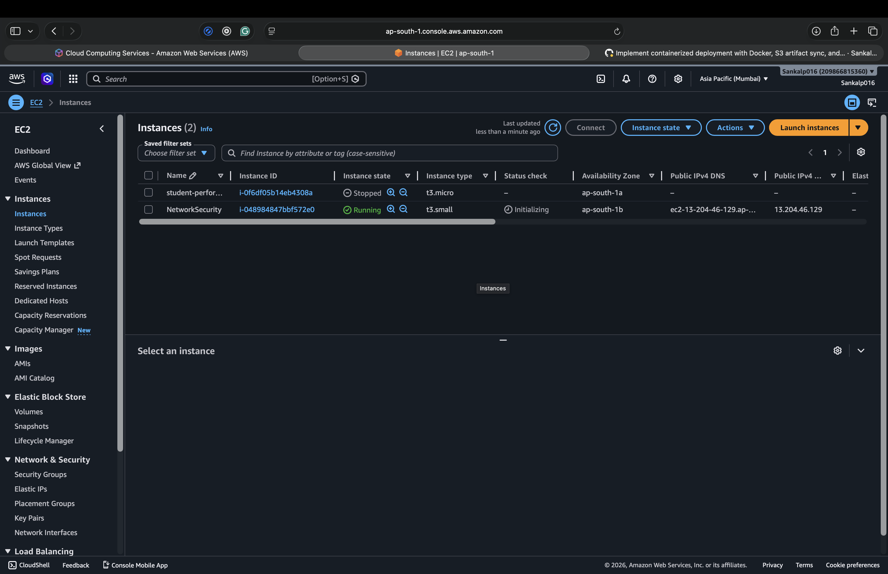

### Amazon EC2 — Instance Details

Instance details confirm public IPv4 `13.204.46.129`, private IP `172.31.3.70`, VPC assignment, and Linux/UNIX AMI platform.

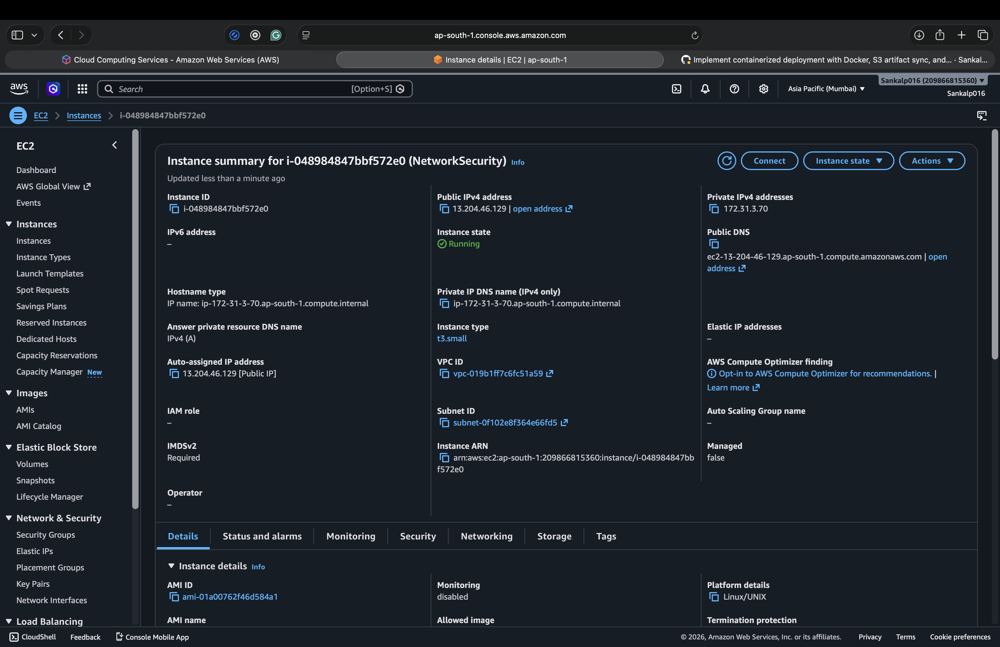

### EC2 Terminal — Docker Image Pulled

`docker images` on the EC2 instance confirms the ECR image `209866815360.dkr.ecr.ap-south-1.amazonaws.com/networksecurity:latest` (3.44 GB on disk, 968 MB content) is present and ready.

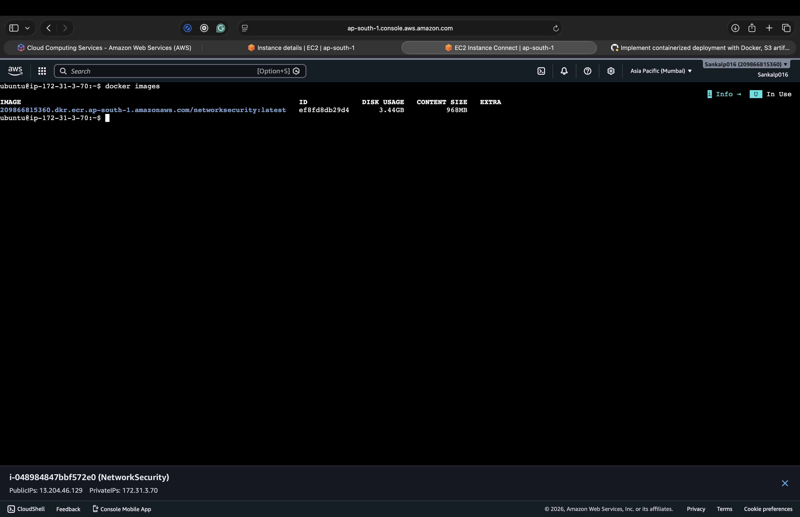

### EC2 Terminal — Docker Login

Ubuntu 26.04 LTS terminal connected via EC2 Instance Connect. `docker ps` output confirms the host is live and Docker is operational.

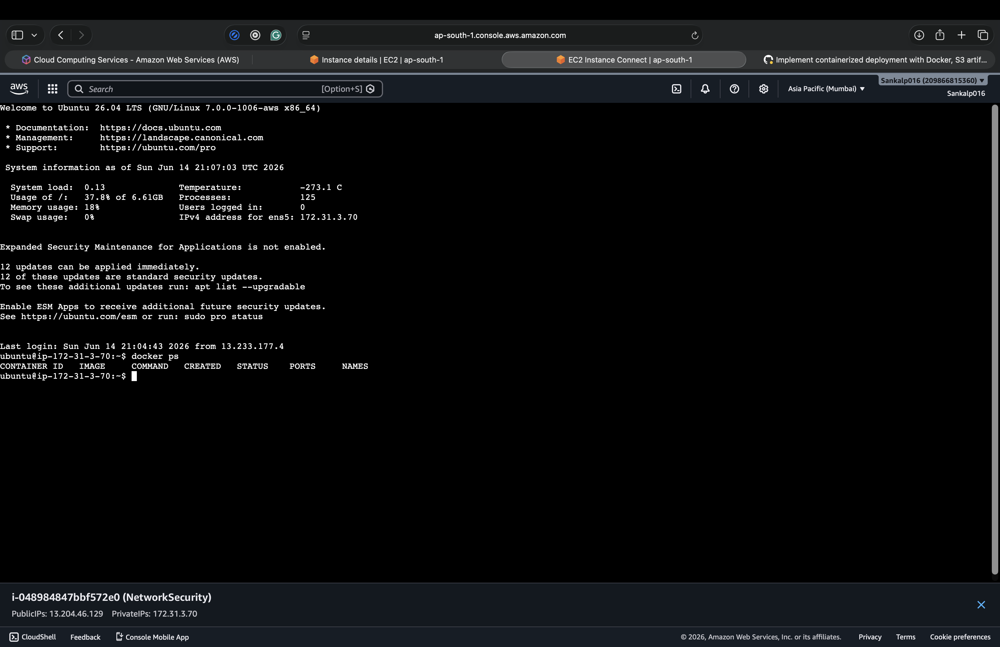

### Swagger UI — Network Security Prediction API

Auto-generated OpenAPI 3.1 documentation at `/docs` exposes `GET /`, `GET /health`, and `POST /predict` endpoints with full schema definitions for `PredictionResponse`, `HTTPValidationError`, and request bodies.

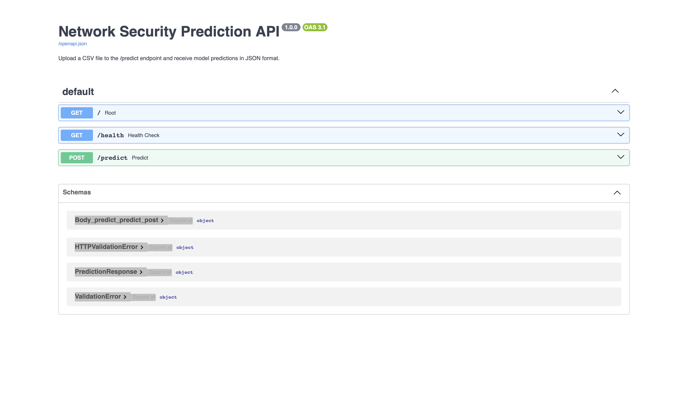

---

## Engineering Challenges

**1. Cross-platform Docker build.** The local development machine used Apple Silicon (ARM64) while EC2 runs x86_64. Without `--platform linux/amd64`, pulled images silently failed. Resolved by adopting `docker buildx` in the CI workflow with explicit platform targeting.

**2. SMOTE after scaling, not before.** Applying SMOTE before `StandardScaler.fit_transform` would introduce synthetic samples that then skew the scaler's mean and variance. The pipeline enforces scale → SMOTE order, and the scaler is fit exclusively on pre-SMOTE training data to prevent leakage.

**3. Stateful prediction pipeline initialization.** FastAPI's `@app.on_event("startup")` loads the `PredictionPipeline` once and stores it in `app.state`, avoiding repeated model deserialization on every request. A graceful degradation path (`503` response) handles cases where startup loading fails.

**4. Pipeline stage decoupling.** Each stage accepts either an artifact from the preceding stage or falls back to reading config from YAML. This enables running any single stage independently for debugging without executing the full pipeline.

**5. S3 artifact lifecycle.** The training pipeline pushes artifacts to S3 after evaluation. The Docker container includes the AWS CLI so it can pull the latest model artifacts from S3 at startup — enabling model updates without rebuilding the image.

**6. Data drift enforcement in CI.** The Kolmogorov-Smirnov test runs as a hard gate: if any feature's train/test p-value falls below 0.05, the pipeline raises an exception and deployment is blocked. This prevents distributional shift from silently degrading production accuracy.

---

## Why This Project Stands Out

This project demonstrates production-level MLOps and cloud engineering across the complete delivery lifecycle:

**MLOps concepts demonstrated:** End-to-end ML pipeline with explicit stage contracts; statistical data validation and drift detection; class imbalance handling with SMOTE; configurable model selection via YAML; MLflow experiment tracking with parameter logging and model registry; quality gate thresholds blocking substandard models from deployment.

**Cloud engineering concepts demonstrated:** Multi-service AWS architecture (S3 + ECR + EC2); private container registry with AES-256 encryption; artifact lifecycle management via S3 sync; self-hosted GitHub Actions runner eliminating SSH credential exposure; secrets management via GitHub repository secrets.

**Backend engineering concepts demonstrated:** Async FastAPI with startup lifecycle management; Pydantic response models with strict validation; CORS middleware for cross-origin API access; structured error handling with HTTP status semantics; CSV streaming without temporary file writes.

**Deployment engineering concepts demonstrated:** Reproducible multi-platform Docker build (`linux/amd64`); zero-downtime container replacement strategy (`stop → rm → run`); explicit port binding and process supervision via Uvicorn; containerized AWS CLI for infrastructure interaction at runtime.

---

## Future Improvements

**Kubernetes orchestration.** Migrate from single-container EC2 to an EKS cluster with Horizontal Pod Autoscaler, enabling automatic scale-out under traffic spikes.

**Model monitoring and drift alerting.** Integrate Evidently AI or Whylogs to compute production data distributions and raise alerts when input drift exceeds thresholds — triggering automated retraining workflows.

**Automated retraining pipeline.** Implement scheduled retraining on newly labeled data using Apache Airflow or AWS Step Functions, with automatic model promotion when the new model outperforms the incumbent.

**MLflow Model Registry promotion.** Extend the current MLflow logging to use the Model Registry with Staging → Production promotion gates, enabling tracked rollbacks.

**Blue-Green deployment.** Add a second EC2 instance or ECS task definition to enable zero-downtime deployments by routing traffic after health verification.

**Feature store integration.** Replace the current CSV-based feature store with a dedicated feature store (e.g., Feast) to enable feature reuse across multiple models and real-time feature serving.

**Structured observability.** Add distributed tracing (AWS X-Ray or OpenTelemetry) and centralized log aggregation (CloudWatch Logs) for request-level debugging in production.

---

## Author

**Sankalp Makol**

| Platform | Link |
|---|---|
| GitHub | [github.com/SankalpMakol016](https://github.com/SankalpMakol016) |
| Repository | [github.com/SankalpMakol016/network-security](https://github.com/SankalpMakol016/network-security) |
| Live API | [13.204.46.129:8080/docs](http://13.204.46.129:8080/docs) |

---

<p align="center">
  <sub>Built with Python 3.11 · FastAPI · scikit-learn · MLflow · Docker · AWS (S3 · ECR · EC2) · GitHub Actions</sub>
</p>